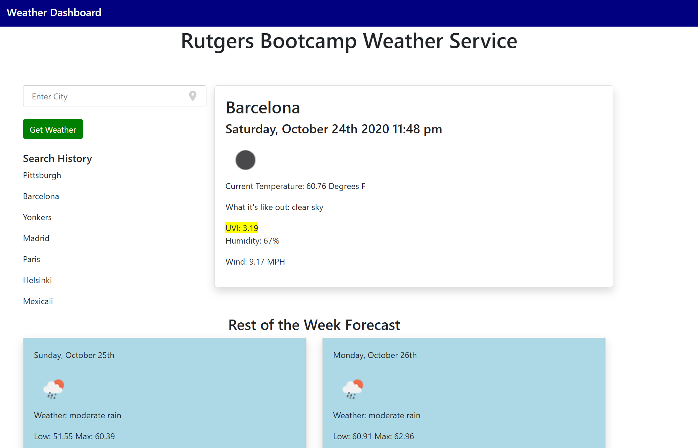

# weather-dashboard
## What it Looks Like

## Core Functionality
- Search weather by city
- Get current weather and 6-day forecast to complete the week
- Save search history, and re-click common searches with ease
- Get the weather of where you're located, automatically 

## Tech Components
- One-Time Weather Maps API 
- Algolia Places search auto-completion and reverse-geocoding 
- Web APIs for location
